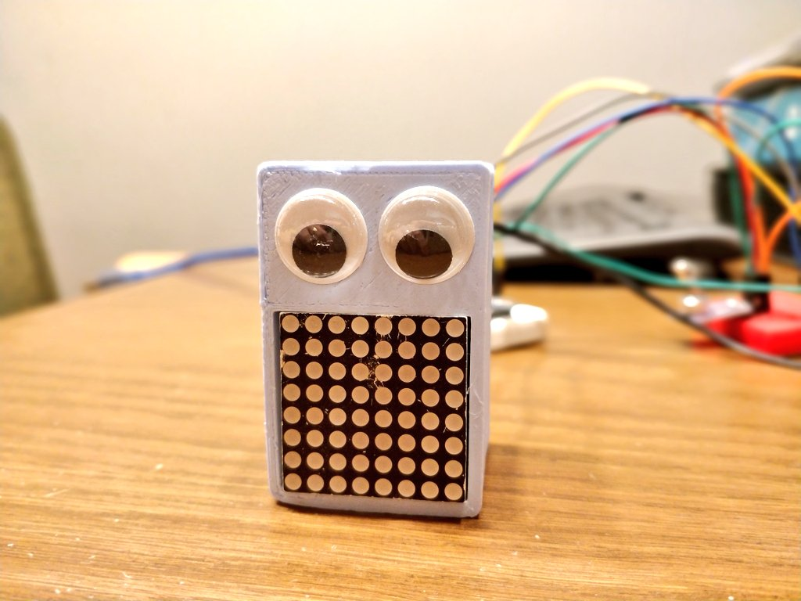
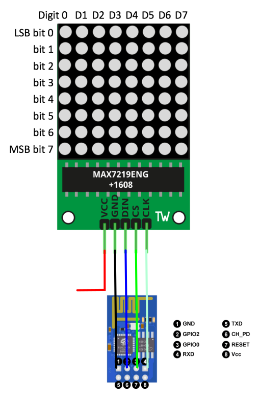
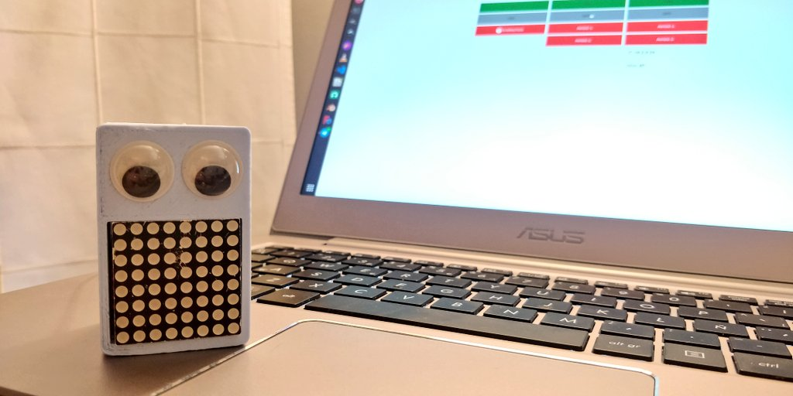
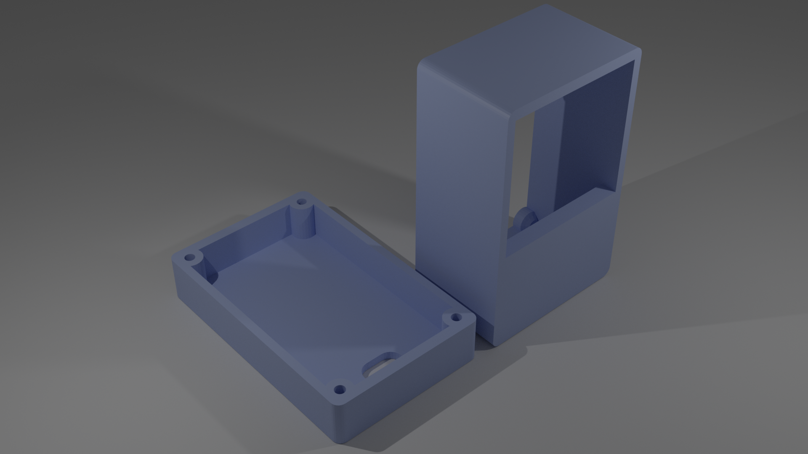
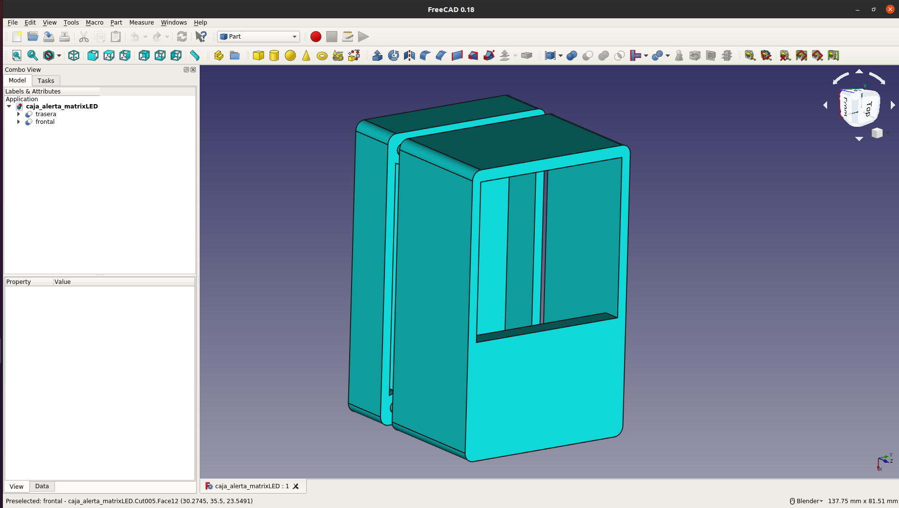

# Alertin

**Alertin** es un pequeño dispositivo conectado a tu red, que puedes utilizar parar que te alerte o avise de alguna cosa.

*Alertin* es un derivado del proyecto *Alert-Box*. Es lo mismo, pero con ojitos pegados, que lo hace mas social, achuchable y menos sobrio y frio.

## Requisitos:

Básicamente los mismos requisitos que tiene *Alert-Box*:

- Servidor MQTT (Mosquitto, por ejemplo)
- Servidor Node-RED (es opcional, pero ideal para controlar mensajes por MQTT)

Estos elementos te permitirán conectar tu **Alertin** a prácticamente cualquier evento que se te ocurra.

## Conexiones:

## Decoración:

Para decorar *Alertin* solamente te hace falta ponerle la mejor cara, y eso se consiguie con dos ojitos. El resto tu imaginación!!!

**"Alerta!!!"**

**"Todo tranquilo,..."**

## Diseño 3D

Un render de los ficheros STL's:

Diseñado mediante FreeCAD. El fichero fuente para su modificación está disponible. Así cómo los ficheros STL.

